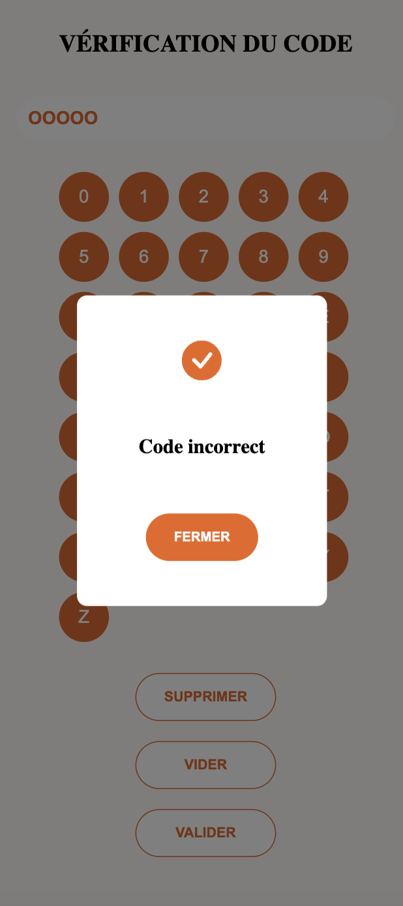

# React Keyboard

Ce projet est une application web de clavier virtuel développée en utilisant React, destinée à permettre aux utilisateurs de saisir des codes spécifiques pour obtenir des offres ou des messages associés.

# Installation

- `git clone` ou extrayez le projet dans votre terminal
- Ouvrez le dossier du projet sur votre pc dans un éditeur de code
- Exécutez `npm install` puis `npm start` dans le terminal de votre éditeur.

# Desktop démo

# Mobile démo

 

